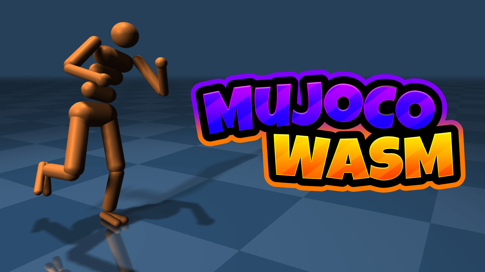

## PHP release demo

The default desktop/mobile demo uses the ONNX pair from PHP's
[student-assets-v1 release](https://github.com/amazon-far/php_parkour/releases/tag/student-assets-v1).
The unchanged model bytes and hashes are in `public/php-release/`.

`assets/scenes/php-release/terrain.obj` is the exact terrain from the PHP release's
Holosoma dependency. `scripts/import-release-terrain.py` splits its 13 connected
components into individual mesh colliders, matching native MuJoCo's handling of
this non-convex course. `g1_release_terrain.xml` uses the generated include and the
release hand inertias. The legacy scene and model files are preserved.
The checkerboard/reflection ground is a Three.js-only presentation layer. The
finite release mesh remains unchanged for both collisions and policy depth;
the presentation plane is excluded from the depth camera and mouse-force picking.

The original finish gate at x=66 is retained unchanged in the final scene. The
import script also writes `assets/scenes/php-release/terrain-with-finish.obj`
and its MTL file, containing the exact release course plus that gate. The source
`terrain.obj` remains unchanged. Gate collision is disabled and it is excluded
from policy depth, as in the original web demo; those flags live in the scene
and renderer because OBJ cannot encode them.

The release controller explicitly matches the native 140-D input:
`actions(29), base_ang_vel(3), dof_pos(29), dof_vel(29), torso_gravity(3),
velocity_command(15), depth_latent(32)`. The ONNX `observation_names` field is a
legacy descriptor and must not be used as the concatenation order for this pair.
Joint observations, action scales, PD targets and actuator writes are mapped by
joint name. W/S move forward/back; A/D select ±45°, Q/E select ±90°; Y or = changes
speed. Direction keys are held, not latched. The default speed is HIGH.

Depth is captured at 10 Hz in simulation time and policy inference at 50 Hz over
500 Hz physics. WebGL rows are converted to top-down before the native crop and
antialiased bicubic resize. The original web demo’s seven-control-step depth
latency buffer (approximately 140 ms) is retained; the policy consumes delayed
depth features while the depth preview shows the current processed frame.
ORT JavaScript/WASM files come from the same installed package, not an unversioned
CDN. Rendering/physics frames are serialized around asynchronous inference.

```bash
npm test                 # MuJoCo WASM mappings + native depth/input/action fixtures
npm run build:terrain    # Regenerate terrain.xml from the unchanged release OBJ
npm run build:web:desktop
npm run build:web:mobile
```

Tests compare preprocessing with native Holosoma fixtures, all 29 joint/actuator
mappings, full input/action parity, every terrain component's bounds, hand mass,
and reset behavior during inference. Native and WASM MuJoCo versions and depth
renderers differ; these checks do not establish identical full trajectories.

<p align="center">
  <a href="https://zalo.github.io/mujoco_wasm/"></a>
</p>
<p align="left">
  <a href="https://github.com/zalo/mujoco_wasm/deployments/activity_log?environment=github-pages">
      </a>
  <!--<a href="https://github.com/zalo/mujoco_wasm/deployments/activity_log?environment=Production">
      </a> -->
  <!--<a href="https://lgtm.com/projects/g/zalo/mujoco_wasm/context:javascript">
      </a> -->
  <a href="https://github.com/zalo/mujoco_wasm/commits/main">
      </a>
  <a href="https://github.com/zalo/mujoco_wasm/blob/main/LICENSE">
      </a>
</p>

## The Power of MuJoCo in your Browser.

Load and Run MuJoCo 3.3.8 Models using JavaScript and the official MuJoCo WebAssembly Bindings.

This project used to be a WASM compilation and set of javascript bindings for MuJoCo, but since Deepmind completed the official MuJoCo bindings, this project is now just a small demo suite in the `examples` folder.

### [See the Live Demo Here](https://zalo.github.io/mujoco_wasm/)

### [See a more Advanced Example Here](https://kzakka.com/robopianist/)

## Build

Simply ensure `npm` is installed and run `npm install` to pull three.js and MuJoCo's Official WASM bindings.

To serve and run the index.html page while developing, use an HTTP Server.  I like to use [five-server](https://github.com/yandeu/five-server).

## JavaScript API

```javascript
import load_mujoco from "./dist/mujoco_wasm.js";

// Load the MuJoCo Module
const mujoco = await load_mujoco();

// Set up Emscripten's Virtual File System
mujoco.FS.mkdir('/working');
mujoco.FS.mount(mujoco.MEMFS, { root: '.' }, '/working');
mujoco.FS.writeFile("/working/humanoid.xml", await (await fetch("./assets/scenes/humanoid.xml")).text());

// Load model and create data
let model = mujoco.MjModel.loadFromXML("/working/humanoid.xml");
let data  = new mujoco.MjData(model);

// Access model properties directly
let timestep = model.opt.timestep;
let nbody = model.nbody;

// Access data buffers (typed arrays)
let qpos = data.qpos;  // Joint positions
let qvel = data.qvel;  // Joint velocities
let ctrl = data.ctrl;  // Control inputs
let xpos = data.xpos;  // Body positions

// Step the simulation
mujoco.mj_step(model, data);

// Run forward kinematics
mujoco.mj_forward(model, data);

// Reset simulation
mujoco.mj_resetData(model, data);

// Apply forces (force, torque, point, body, qfrc_target)
mujoco.mj_applyFT(model, data, [fx, fy, fz], [tx, ty, tz], [px, py, pz], bodyId, data.qfrc_applied);

// Clean up
data.delete();
model.delete();
```
